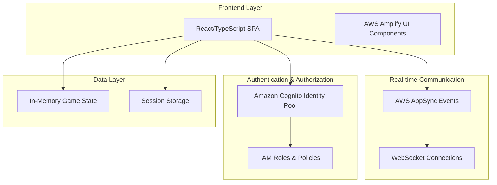

# Design Document

## Overview

The Resistance Web Game is a real-time multiplayer web application built using AWS Amplify Gen 2, React, and TypeScript. The application leverages AWS AppSync Events for real-time communication between players, enabling seamless gameplay experiences without the need for traditional REST APIs or complex WebSocket management.

The game supports 5-10 players in strategic social deduction gameplay where players are divided into Resistance and Spy teams. The architecture emphasizes real-time state synchronization, secure role-based visibility, and scalable serverless infrastructure.

## Architecture

The application follows a serverless, event-driven architecture using AWS managed services:



### Key Architectural Decisions

1. **Serverless-First**: No persistent databases or EC2 instances required
2. **Real-time by Default**: All game interactions use WebSocket connections via AppSync Events
3. **Stateless Backend**: Game state maintained in client memory and synchronized via events
4. **Unauthenticated Access**: Uses Cognito Identity Pool for secure anonymous access
5. **Event-Driven**: All game actions trigger events that update all connected clients

## Components and Interfaces

### Core Components

#### GameRoom Component
- **Purpose**: Manages the overall game session and player connections
- **State**: Room code, player list, game phase, mission history
- **Events**: PlayerJoined, PlayerLeft, GameStarted, GameEnded

#### PlayerManager Component  
- **Purpose**: Handles player registration, readiness status, and role assignment
- **State**: Player names, ready status, assigned roles, leadership rotation
- **Events**: PlayerReady, RolesAssigned, LeadershipChanged

#### MissionController Component
- **Purpose**: Orchestrates mission phases (team building, voting, execution)
- **State**: Current mission, selected team, vote results, mission outcomes
- **Events**: TeamSelected, VotingStarted, MissionCompleted

#### GameBoard Component
- **Purpose**: Visual representation of players and game state
- **State**: Player positions, role visibility, current phase indicators
- **Events**: UIUpdated, RoleRevealed

#### EventManager Component
- **Purpose**: Handles all real-time communication via AppSync Events
- **Methods**: 
  - `connect(roomCode: string)`: Establish WebSocket connection
  - `publish(event: GameEvent)`: Send events to all players
  - `subscribe(callback: EventHandler)`: Listen for incoming events

### Data Models

#### GameState Interface
```typescript
interface GameState {
  roomCode: string;
  phase: GamePhase;
  players: Player[];
  currentLeader: string;
  currentMission: number;
  missionHistory: MissionResult[];
  resistanceScore: number;
  spyScore: number;
  gameLog: LogEntry[];
}
```

#### Player Interface
```typescript
interface Player {
  id: string;
  name: string;
  role: 'resistance' | 'spy';
  isReady: boolean;
  isConnected: boolean;
  isLeader: boolean;
}
```

#### Mission Interface
```typescript
interface Mission {
  number: number;
  requiredPlayers: number;
  selectedPlayers: string[];
  votes: Record<string, boolean>;
  results: Record<string, boolean>;
  outcome: 'success' | 'failure';
}
```

### Event System

#### Event Types
- **RoomEvents**: PlayerJoined, PlayerLeft, GameStarted
- **MissionEvents**: TeamSelected, VotingPhase, ExecutionPhase, MissionCompleted
- **SystemEvents**: LeadershipChanged, GameEnded, ErrorOccurred

#### Event Flow
1. Player action triggers local state update
2. Event published to AppSync Events channel
3. All connected clients receive event
4. Clients update local state based on event
5. UI re-renders with new state

## Correctness Properties

*A property is a characteristic or behavior that should hold true across all valid executions of a system-essentially, a formal statement about what the system should do. Properties serve as the bridge between human-readable specifications and machine-verifiable correctness guarantees.*

### Property 1: Room Code Generation Uniqueness
*For any* sequence of application loads, each generated room code should be unique and consist of exactly 6 alphanumeric characters
**Validates: Requirements 1.1**

### Property 2: Room Creation Consistency
*For any* generated room code, clicking "New Game" should create a Game_Room that can be referenced by that exact code
**Validates: Requirements 1.2**

### Property 3: Room Joining Validation
*For any* valid room code, a player should be able to join the corresponding Game_Room, and for any invalid room code, joining should be prevented with an error message
**Validates: Requirements 1.3, 1.4**

### Property 4: Ready State Synchronization
*For any* player's ready status change, all other players in the same Game_Room should see the updated status immediately
**Validates: Requirements 2.3, 2.5**

### Property 5: Game Start Conditions
*For any* Game_Room with at least 5 ready players, the "Start Game" button should be enabled for the room creator, and for rooms with fewer than 5 ready players, it should be disabled
**Validates: Requirements 3.1**

### Property 6: Role Assignment Distribution
*For any* game with N players (5 ≤ N ≤ 10), the role assignment should follow the exact distribution specified in the requirements table
**Validates: Requirements 4.1, 4.2, 4.3, 4.4, 4.5, 4.6**

### Property 7: Role Assignment Randomness
*For any* set of players starting multiple games, role assignments should be distributed randomly across games (no player should always get the same role)
**Validates: Requirements 4.7**

### Property 8: Role Visibility Rules
*For any* Spy_Team member, all player roles should be visible, and for any Resistance_Team member, only their own role should be visible
**Validates: Requirements 5.4, 5.5**

### Property 9: Mission Team Size Enforcement
*For any* mission and player count combination, the Mission_Leader should only be able to prepare a mission when the correct number of players is selected according to the official rules
**Validates: Requirements 6.4, 6.5**

### Property 10: Voting Majority Rules
*For any* team approval vote, if the majority votes "Yes", the game should proceed to mission execution, otherwise leadership should pass to the next player alphabetically
**Validates: Requirements 7.4, 7.5**

### Property 11: Mission Execution Button Availability
*For any* mission participant, if they are Resistance_Team, the "Fail" button should be disabled, and if they are Spy_Team, both buttons should be enabled
**Validates: Requirements 8.2, 8.3**

### Property 12: Mission Scoring Rules
*For any* completed mission, if all participants choose "Success", Resistance_Team gets 1 point, otherwise Spy_Team gets 1 point
**Validates: Requirements 8.5, 8.6**

### Property 13: Leadership Rotation
*For any* completed mission or failed vote, leadership should pass to the next player in alphabetical order
**Validates: Requirements 9.1**

### Property 14: Victory Condition Detection
*For any* game state where either team reaches 3 points, the game should end immediately and display the correct winning team
**Validates: Requirements 11.1, 11.2**

### Property 15: Game Log Completeness
*For any* game action that should be logged (mission details, votes), the information should appear in the game log, and for actions that shouldn't be logged (individual mission choices), they should not appear
**Validates: Requirements 10.1, 10.2, 10.3, 10.4**

## Error Handling

### Connection Management
- **WebSocket Disconnections**: Implement automatic reconnection with exponential backoff
- **Network Failures**: Queue events locally and sync when connection is restored
- **Player Timeouts**: Remove inactive players after 5 minutes of inactivity

### Game State Validation
- **Invalid Actions**: Prevent and log attempts to perform actions outside current game phase
- **State Desynchronization**: Implement state reconciliation when clients detect inconsistencies
- **Malformed Events**: Validate all incoming events against expected schemas

### User Experience
- **Loading States**: Show appropriate loading indicators during connection establishment
- **Error Messages**: Display user-friendly error messages for common failure scenarios
- **Graceful Degradation**: Maintain core functionality even when some features fail

## Testing Strategy

The testing approach combines unit tests for specific functionality with property-based tests for universal game rules and behaviors.

### Unit Testing
Unit tests will focus on:
- Component rendering and user interactions
- Event handling and state management
- Game rule validation for specific scenarios
- Error boundary behavior
- Integration between React components and AWS services

### Property-Based Testing
Property-based tests will validate universal properties using **fast-check** library for TypeScript:
- Each property test will run a minimum of 100 iterations with randomized inputs
- Tests will generate random game states, player configurations, and action sequences
- Properties will be tagged with comments referencing their design document property number

**Property Test Configuration:**
- Library: fast-check (TypeScript property-based testing library)
- Minimum iterations: 100 per property test
- Tag format: `// Feature: resistance-web-game, Property {number}: {property_text}`

**Example Property Test Structure:**
```typescript
// Feature: resistance-web-game, Property 6: Role Assignment Distribution
test('role assignment follows correct distribution', () => {
  fc.assert(fc.property(
    fc.integer({min: 5, max: 10}), // player count
    (playerCount) => {
      const roles = assignRoles(playerCount);
      const expectedDistribution = getRoleDistribution(playerCount);
      expect(countRoles(roles)).toEqual(expectedDistribution);
    }
  ), { numRuns: 100 });
});
```

### Integration Testing
- End-to-end game flows using automated browser testing
- Real-time synchronization between multiple client instances
- AWS service integration testing with local Amplify sandbox

### Testing Priorities
1. **Critical Path**: Room creation, joining, role assignment, mission execution
2. **Real-time Features**: Event synchronization, state consistency across clients
3. **Game Logic**: Victory conditions, role visibility, voting mechanics
4. **Error Scenarios**: Network failures, invalid inputs, edge cases

The dual testing approach ensures both specific examples work correctly (unit tests) and universal game rules hold across all possible inputs (property tests), providing comprehensive coverage for this complex multiplayer game system.